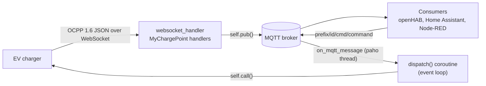

# Architecture

ocpp2mqtt is one Python process in one container. It is an OCPP 1.6 Central
System that chargers connect to, and an MQTT client that mirrors what the
chargers report and relays commands back. It keeps no state on disk.

## Components

| # | Component | Where in `central_system.py` | Responsibility |
|---|---|---|---|
| 1 | Configuration | top of the module | Environment to constants, logging format and level |
| 2 | MQTT client `mqttc` | module level, wired in `main()` | One shared paho client (client id `ocpp2mqtt`, clean session), LWT on `bridge/status`, reconnect back-off 1 to 30 s, network loop in its own thread |
| 3 | WebSocket server | `main()` | `websockets.serve()` on `0.0.0.0:<OCPP_PORT>`, subprotocol `ocpp1.6` |
| 4 | Connection handler | `websocket_handler()` | Charger id from the URL path, registration, command subscription, teardown on close |
| 5 | Charger object | `MyChargePoint` | One per connection: OCPP handlers (charger to CSMS) and commands (CSMS to charger) |
| 6 | Registry | `connected_chargers` | Charger id to `MyChargePoint`; written by the event loop, read by the paho thread |
| 7 | Command dispatcher | `on_mqtt_message()`, `dispatch()` | Parses `cmd/<command>`, hands the coroutine to the event loop |
| 8 | Reconnect hook | `on_mqtt_connect()` | Re-asserts `online`, publishes expected chargers as `Disconnected`, re-subscribes commands |

## Data flow

## Threading model

- The **main thread** runs the asyncio event loop: WebSocket server, every
  `MyChargePoint`, every OCPP call.
- **paho's network thread** runs the MQTT callbacks. `on_mqtt_message()`
  never calls a charger directly: it wraps the command in a coroutine and
  submits it with `asyncio.run_coroutine_threadsafe(dispatch(), loop)`, so
  the OCPP call runs on the loop that owns the socket.
- `mqttc.publish()` is called from both threads; paho's publish is
  thread-safe. `connected_chargers` is a plain dict shared without a lock.
- The returned future is not kept: whatever happens inside `dispatch()`
  (timeout, CallError, bad payload) is not logged by the bridge.

## Connection lifecycle

1. A charger opens `ws://<host>:<OCPP_PORT>/<charger_id>`; the last path
   segment becomes its id and its MQTT topic level.
2. The bridge registers it, publishes `status=Connected` and
   `last_connected` (retained) and subscribes `<MQTT_PREFIX>/<id>/cmd/#`.
3. `charger.start()` reads OCPP messages until the socket closes. A
   `BootNotification` is accepted with a heartbeat interval of 30 s.
4. When the socket closes, the reason is `normal_closure` (close frame
   received), `connection_error_<code>` or `connection_error` (no close frame;
   code 1006 has been observed when a charger rebooted), or `unexpected_error`.
5. Teardown: remove the charger from the registry, unsubscribe its commands,
   re-publish instantaneous power and current as `0.0`, then publish
   `status=Disconnected`, `disconnect_reason` and `last_disconnected`
   (retained).

## State

Everything lives in memory and is lost on restart:

- `connected_chargers`: who is connected now;
- per charger: `_current_transaction_id` (always `1` while a session is
  tracked), `_meter_topics` (meter topics and units seen on this connection,
  used for the zeroing at teardown).

Retained topics on the broker are the only memory across restarts. If the
process dies without a teardown, `<id>/status` keeps its last value: read it
together with `bridge/status`.

## Failure behaviour

| # | Situation | What happens | Recovery |
|---|---|---|---|
| 1 | Broker unreachable at startup | `connect()` raises, the process exits | Docker restart policy `always` |
| 2 | Broker connection lost | The broker publishes the retained LWT `offline`; paho reconnects with 1 to 30 s back-off | `on_mqtt_connect()` restores `online` and the command subscriptions |
| 3 | Charger socket lost | Teardown as above | The charger reconnects on its own |
| 4 | Charger does not answer a command within 30 s | `asyncio.TimeoutError` inside `dispatch()`, not logged | No `.../response` topic |
| 5 | Charger answers a command with a CallError | The `ocpp` library logs `Received a CALLError` and returns `None`; the bridge then fails on `resp.status`, not logged | No `.../response` topic |
| 6 | Command for an id that is not connected | Warning `Command for a charger that is not connected` | Dropped |
| 7 | OCPP action without a handler | The `ocpp` library answers `NotImplemented` | None |
| 8 | SIGTERM or SIGINT | Server closed, `bridge/status` `offline`, MQTT disconnected | Orderly stop |

## Design decisions

1. **Trusted network, no access control.** The WebSocket is not
   authenticated and `Authorize`/`StartTransaction` accept any tag: the
   target is a private charger on a home network, not a public station.
2. **Fixed transaction id.** Each session gets id `1`; there is no billing
   backend to reconcile against.
3. **Retained state, volatile telemetry.** Connection state, connector state
   and firmware are retained so a late consumer sees them at once; meter
   values, heartbeats, sessions and command responses are not.
4. **Zeroing on disconnect.** Power and current go to `0.0` when a charger
   disconnects, so a dashboard does not show a frozen "still charging"
   value; cumulative energy and voltages keep their last value.
5. **Flat meter topics.** Each sampled value gets its own topic keyed by
   measurand and phase, so consumers subscribe only to what they use.
6. **Current limit as default profile.** `set_limit` sends a
   `TxDefaultProfile` (profile id 1, stack level 0, relative, amperes) that
   replaces the previous one; connector 0 means the whole station.
7. **Expected chargers.** Ids listed in `EXPECTED_CHARGERS` are published as
   `Disconnected` on every MQTT connect, so consumers do not wait for a
   first boot. With the current compose file the variable does not reach
   the container.

## Scaling and limits

- Several chargers can connect at once, each with its own id and topics;
  all run in one event loop.
- The `ocpp` library allows one outstanding call per charger: a second
  command waits until the first is answered or times out (30 s).
- One bridge per broker: the MQTT client id is fixed, and a charger talks to
  a single Central System.
- The `ocpp` library logs every frame at INFO: a charger sampling every few
  seconds produced about 29,000 log lines in 19 hours.

## External dependencies

| # | Dependency | Used for | Notes |
|---|---|---|---|
| 1 | OCPP 1.6 JSON charger | input and commands | Census in [API.md](API.md#ocpp-16-census) |
| 2 | MQTT broker | output and command input | MQTT 3.1.1, QoS 0, keepalive 60 s |
| 3 | `ocpp` 1.0.0 | OCPP routing, validation, 30 s response timeout | Unhandled actions answered `NotImplemented` |
| 4 | `websockets` 12.0 | WebSocket server | Legacy handler API `(websocket, path)` |
| 5 | `paho-mqtt` 1.6.1 | MQTT client | Version 1 callback API |
